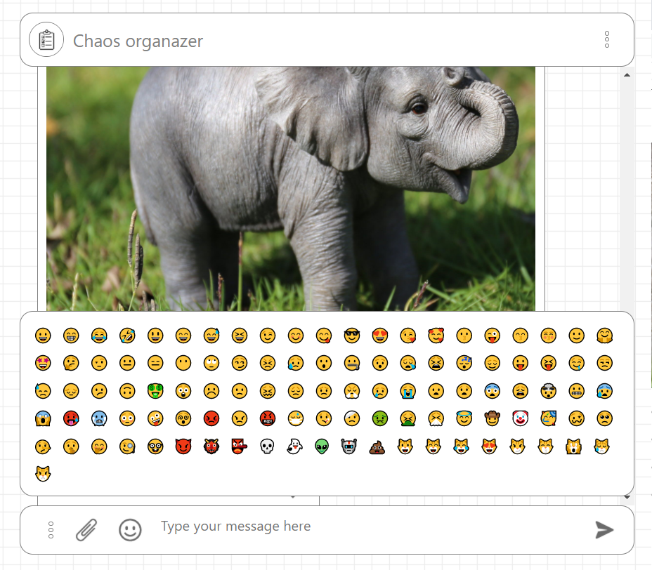

[ссылка на приложение](https://yushkevich-a-a.github.io/ahj-diploma/);

[ссылка на репозиторий приложения](https://github.com/Yushkevich-A-A/ahj-diploma);

[ссылка на сервер](https://yushkevich-ahj-diploma-server.herokuapp.com/);

[ссылка на репозиторий сервера](https://github.com/Yushkevich-A-A/ahj-diploma-server);

## реализованы основные 5 функций :

* Сохранение в истории ссылок и текстовых сообщений 

* Ссылки (то, что начинается с http:// или https://) сохраняются в историии переписки и кликабельны

* Сохранение в истории изображений, видео и аудио через скрепку и функцию Drag`n`drop с превьюшкой прикрепленного файла. Загрузка файлов на сервер происходит с отправлением файлов и сохранением их в папке public. Отображение у клиента происходит как отображение самой картинки, видео или аудио с возможностью управления процессом воспроизведения.

Прикрепить файл

перетащить с рабочего стола

превью прикрепленного файла

* Скачивание файлов на компьютер пользователя при нажатии на кнопку скачать.

* Ленивая подгрузка: сначала подгружаются последние 10 сообщений, при прокрутке вверх подгружаются более ранние сообщения по 10шт (для примера взяты сгенерированные текстовые сообщения. Перевод на русский язык не осуществлял, т.к. при переводе предложений с Faker на русский язык получается белиберда в смысловой сути самого предложения)

========================================================

## реализованы дополнительные функции

* В разных окнах, на разных устройствах контент синхронизуется при отправке новых сообщений

* Запись видео и аудио (используя API браузера)

* Отправка геолокации

Для запуска функции отправки геолокации, записи видео и аудио необходимо нажать на кнопку дополнительного меню слева от скрепки

откроется дополнительное меню с набором функций.

* Воспроизведение видео/аудио (используя API браузера)

* Установка напоминаний через Notification API. (Работоспособность проверена в хроме и в Edge)

* Отправка команд боту: 
     1. @chaos: погода - рандомно присылает шуточный прогноз погоды
     2. @chaos: такси - присылает список номеров телефонов такси
     3. @chaos: цитата - рандомно присылает цитату философов
     4. @chaos: экстренно - присылает список номеров телефонов экстренных служб
     5. @chaos: курс - присылает фейковый курс валют USD, EUR -> интеграции ни с какими сервисами произведено не было

В данном функционале реализована возможность подсказки по командам к боту. Данная подсказка находится в дополнительном меню

* возможность отправки emoji

Да, и если нет разрешения на использование API или браузер не поддерживает функцию, будет вылезать соответствующая ошибка